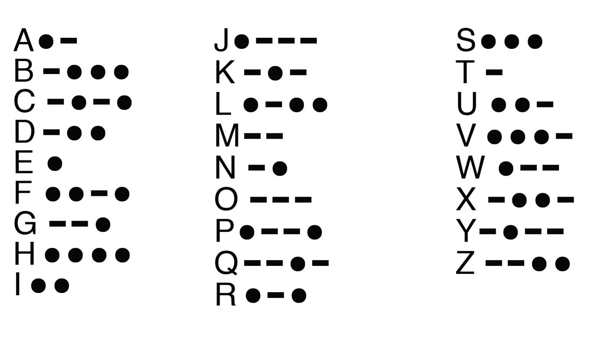

 
   

  <h3><b>Morse-Code Decoder</b></h3>

<!-- TABLE OF CONTENTS -->

# 📗 Table of Contents

- [📗 Table of Contents](#-table-of-contents)
- [📖 \[Morse-Code Decoder\] ](#-morse-code-decoder-)
  - [🛠 Built With Ruby](#-built-with-ruby)
    - [Tech Stack ](#tech-stack-)
  - [💻 Getting Started ](#-getting-started-)
  - [Prerequisites](#prerequisites)
    - [Setup](#setup)
  - [Usage](#usage)
  - [👥 Authors ](#-authors-)
  - [🔭 Future Features ](#-future-features-)
  - [🤝 Contributing ](#-contributing-)
  - [⭐️ Show your support ](#️-show-your-support-)
  - [🙏 Acknowledgments ](#-acknowledgments-)
  - [❓ FAQ ](#-faq-)
  - [📝 License ](#-license-)

<!-- PROJECT DESCRIPTION -->

# 📖 [Morse-Code Decoder] 

**[Morse-Code Decoder]** Morse-Code Decoder is a ruby program that decodes, a character, word or sentence from a morse code, morse code is a method used in telecommunication to encode text characters as standardized sequences of two different signal durations, called dots and dashes, or dits and dahs. Morse code is named after Samuel Morse, one of the inventors of the telegraph.

## 🛠 Built With <a name="built-with">Ruby</a>

### Tech Stack 

Ruby

  <ul>
  <li><a href="https://www.ruby-lang.org/en/">Ruby</a></li>
  </ul>

(<a href="#readme-top">back to top</a>)

<!-- GETTING STARTED -->

## 💻 Getting Started 
To get a local copy up and running follow these simple example steps.

## Prerequisites
Have `Ruby`, and `Git` installed

### Setup

Clone this repository to your desired folder:

- git clone https://github.com/JonahKayizzi/Decode-Morse-Code-Ruby.git
- cd Decode-Morse-Code-Ruby

## Usage
ruby `morse.rb`

(<a href="#readme-top">back to top</a>)

<!-- AUTHORS -->

## 👥 Authors 

👤 **Jonathan Kayizzi**

- GitHub: [@JonahKayizzi](https://github.com/JonahKayizzi)
- Twitter: [@JonahKayizzi](https://twitter.com/JonahKayizzi)
- LinkedIn: [LinkedIn](https://www.linkedin.com/in/jonathan-kayizzi/)

👤 **Miliyon Ayalew**

- GitHub: [@Miliyonayalew](https://github.com/Miliyonayalew/)
- Twitter: [@Miliyonayalew](https://twitter.com/MilaAyalew)
- LinkedIn: [Miliyonayalew](https://www.linkedin.com/in/miliyon-ayalew-210808131/)

(<a href="#readme-top">back to top</a>)

<!-- FUTURE FEATURES -->

## 🔭 Future Features 

(<a href="#readme-top">back to top</a>)

<!-- CONTRIBUTING -->

## 🤝 Contributing 

Contributions, issues, and feature requests are welcome!

Feel free to check the [issues page](https://github.com/JonahKayizzi/clinic-database-pair-programming/issues).

(<a href="#readme-top">back to top</a>)

<!-- SUPPORT -->

## ⭐️ Show your support 

If you like this project, please leave star

(<a href="#readme-top">back to top</a>)

<!-- ACKNOWLEDGEMENTS -->

## 🙏 Acknowledgments 

(<a href="#readme-top">back to top</a>)

<!-- FAQ (optional) -->

## ❓ FAQ 

(<a href="#readme-top">back to top</a>)

<!-- LICENSE -->

## 📝 License 

This project is [MIT](./LICENSE) licensed.

(<a href="#readme-top">back to top</a>)

